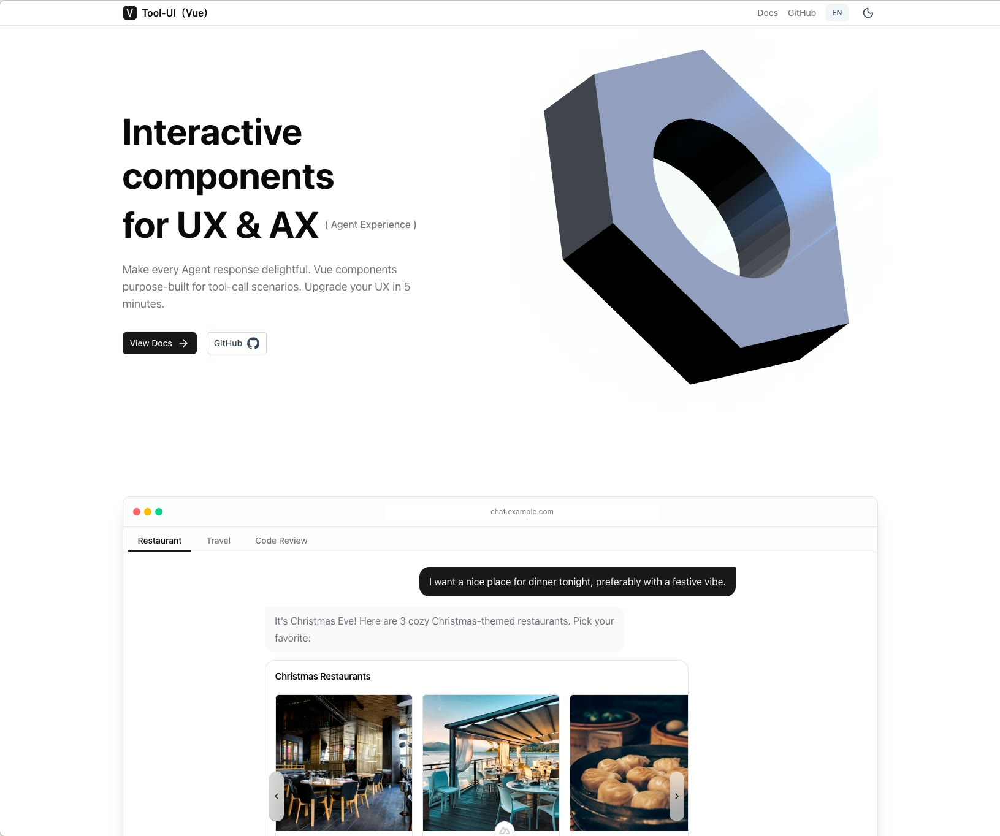

[中文](readme.zh.md)

# tool-ui-vue (vtu)

Vue 3 cmpts for interactive AI tool call widgets.



Home: https://lionad-morotar.github.io/tool-ui-vue/

## Quick Start

If you use an agent, install in one prompt:

```
Install github.com/Lionad-Morotar/tool-ui-vue and create a /dev/tool-ui-vue page for development and debugging
```

Or, if you prefer the traditional approach:

```bash
pnpm add @lionad/vtu-components
```

```vue
<script setup lang="ts">
import { Terminal } from '@lionad/vtu-components'
</script>

<template>
  <Terminal
    id="term-1"
    command="pnpm install"
    stdout="added 42 packages in 2s"
    :exit-code="0"
    :duration-ms="2150"
  />
</template>
```

## Skills

```bash
npx skills add https://github.com/Lionad-Morotar/tool-ui-vue
```

More about skills: [@lionad/vtu-skills](/packages/skills/tool-ui-vue/SKILL.md)

**For Agent**: read skills to understand how to install vtu in a project.

## MCP Server

```json
{
  "mcpServers": {
    "tool-ui-vue": {
      "command": "npx",
      "args": ["-y", "vtu-mcp-server"]
    }
  }
}
```

More about MCP server: [@lionad/vtu-server](/packages/server/README.md)
