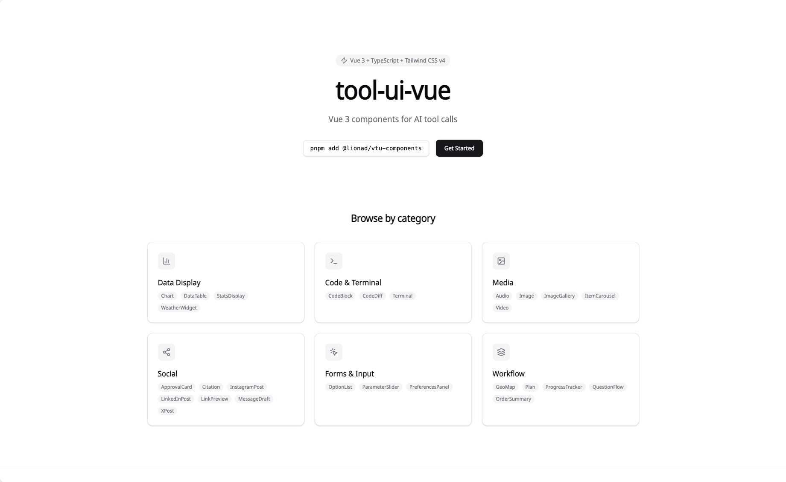

# tool-ui-vue

Vue 3 component library for AI tool call widgets (copy-paste style).



Preview: https://lionad-morotar.github.io/tool-ui-vue/

## 快速开始 (Quick Start)

```bash
pnpm add @lionad/vtu-components
```

```vue
<script setup lang="ts">
import { Terminal } from '@lionad/vtu-components'
</script>

<template>
  <Terminal
    id="term-1"
    command="pnpm install"
    stdout="added 42 packages in 2s"
    :exit-code="0"
    :duration-ms="2150"
  />
</template>
```

## 多语言 i18n

组件库默认使用 **zh-CN（中文）** 作为界面语言，同时提供 en（英文）翻译。i18n 系统零外部依赖，基于 Vue 3 `provide/inject` 实现。

### 基础用法

在应用顶层使用 `LocaleProvider` 包裹，传入对应语言的消息文件：

```vue
<script setup lang="ts">
import { LocaleProvider } from '@lionad/vtu-components'
import { zhCN } from '@lionad/vtu-components/i18n'
// 或 import { zhCN } from '@lionad/vtu-core/i18n'
</script>

<template>
  <LocaleProvider :messages="zhCN" locale="zh-CN">
    <YourApp />
  </LocaleProvider>
</template>
```

### 在组件中使用 `t()`

```vue
<script setup lang="ts">
import { useI18n } from '@lionad/vtu-core/i18n'

type MessageSchema = { shared: { copy: string; cancel: string } }
const { t } = useI18n<MessageSchema>()

// t() 返回 ComputedRef<string>，在模板中自动解包
const copyText = t('shared.copy')
</script>

<template>
  <!-- 模板中自动解包，直接渲染文字 -->
  <button>{{ copyText }}</button>

  <!-- JS 中需要 .value -->
  <button @click="doCopy(copyText.value)">{{ copyText }}</button>
</template>
```

`t()` 返回的 `ComputedRef` 会在语言切换时自动更新，无需手动操作 DOM。

### 语言切换

```vue
<script setup lang="ts">
import { LocaleProvider, zhCN, en } from '@lionad/vtu-components/i18n'
import { ref } from 'vue'

const locale = ref<'zh-CN' | 'en'>('zh-CN')
const messages = { 'zh-CN': zhCN, en }
</script>

<template>
  <LocaleProvider :messages="messages[locale]" :locale="locale">
    <button @click="locale = locale === 'zh-CN' ? 'en' : 'zh-CN'">
      {{ locale === 'zh-CN' ? 'Switch to English' : '切换中文' }}
    </button>
    <YourApp />
  </LocaleProvider>
</template>
```

## API 参考 (API Reference)

### LocaleProvider

| Prop | Type | Default | Description |
|------|------|---------|-------------|
| `messages` | `TMessages` | (required) | 语言消息对象 |
| `locale` | `string` | `'zh-CN'` | 当前语言标识 |

### useI18n()

返回 `{ t, locale, setLocale }`：

| 成员 | 类型 | 说明 |
|------|------|------|
| `t` | `(key, params?) => ComputedRef<string>` | 翻译函数，支持 `{param}` 插值 |
| `locale` | `ReadonlyRef<string>` | 当前语言 |
| `setLocale` | `(locale: string) => void` | 切换全局语言 |

### t() 签名

```typescript
t(key: DeepKeyPath<TMessages>, params?: Record<string, ParamValue>): ComputedRef<string>
```

- `key`：点分路径，如 `'shared.copy'`，TypeScript 自动补全
- `params`：插值参数，替换模板中的 `{param}`
- 缺失 key：dev 模式 `console.warn`，返回 key 字符串

### 导出路径

| 模块 | 导出 |
|------|------|
| `@lionad/vtu-components` | `LocaleProvider`, `zhCN`, `en` |
| `@lionad/vtu-core/i18n` | `useI18n`, `setLocale`, `setMessages`, types |

> 完整 API 文档：[API-i18n.md](.planning/docs/API-i18n.md)

## 自定义语言 (Custom Languages)

创建自定义语言文件，保持与 `zh-CN.ts` 相同的 key 结构：

```typescript
// ja.ts
export const ja = {
  shared: {
    copy: 'コピー',
    copied: 'コピーしました',
    cancel: 'キャンセル',
    // ... 与 zh-CN.ts 相同结构
  },
  terminal: { copyOutput: '出力をコピー' },
  // ... 其他命名空间
} as const
```

使用自定义语言：

```vue
<LocaleProvider :messages="ja" locale="ja">
  <YourApp />
</LocaleProvider>
```

只需 key 结构与 `zh-CN.ts` 一致，无需导入任何核心包。

## 消费者指南

- **零侵入模式**：不使用 LocaleProvider 时，组件以内置 zh-CN 文案正常渲染，不会显示 key 字符串
- **Copy-Paste 模式**：直接复制 `.vue` 文件到项目，组件内 `useI18n()` 自动 fallback
- **完整接入指南**：[CONSUMER-ONBOARDING.md](.planning/docs/CONSUMER-ONBOARDING.md)
